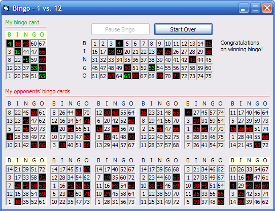



## Bingo \- 1 vs\. 12

### Description

Indeed, it's the game everybody loves. Bingo. This is a simulation of the popular game and it's automated. Even though you just watch the spaces go rather than getting involved while playing, this game can be useful if you want to kill time. It features playing against 12 other bingo cards and an easy-to-follow interface. The interface consists of the most recently drawn number while in play, red text and black background signifying drawn numbers, the tooltip color background against "BINGO" when a card is one away, and flashing green numbers signifying a bingo. You have the option to pause the game if you need to, and with the game in pause, you have the option to start over if you find that you will most likely lose the game or for any other reason. The simulation stresses how tough getting a bingo could be, so good luck playing, whether it's this game or it's the real bingo game.
 
### More Info
 

             |
---                |---
**Submitted On**   |2007-05-26 18:56:16
**By**             |[mathXpert](https://github.com/Planet-Source-Code/PSCIndex/blob/master/ByAuthor/mathxpert.md)
**Level**          |Intermediate
**User Rating**    |5.0 (15 globes from 3 users)
**Compatibility**  |VB 6\.0
**Category**       |[Games](https://github.com/Planet-Source-Code/PSCIndex/blob/master/ByCategory/games__1-38.md)
**World**          |[Visual Basic](https://github.com/Planet-Source-Code/PSCIndex/blob/master/ByWorld/visual-basic.md)
**Archive File**   |[Bingo\_\-\_1\_2067635262007\.zip](https://github.com/Planet-Source-Code/mathxpert-bingo-1-vs-12__1-68679/archive/master.zip)

